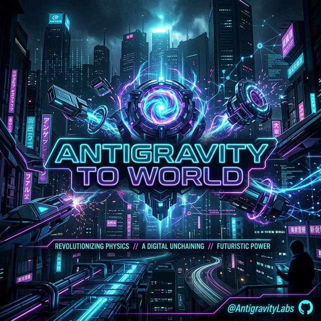

# 🌌 Antigravity to World 🌌



> **"Unchaining Digital Potential. One Skill at a Time."**

Welcome to the definitive collection of high-performance agentic skills. This repository contains **1000+ integrated modules** designed for the Antigravity ecosystem, enabling autonomous execution across OSINT, Cyber Warfare, Advanced Automation, and AI Orchestration.

---

## 🚀 Quick Setup Guide

To integrate these skills into your Antigravity environment:

### 1. Requirements
Ensure you have the Antigravity core system installed and active workspaces configured.

### 2. Installation
Clone the repository and copy the modules to your local agent hub:
```bash
git clone https://github.com/oki3505F/antigravity-to-world
cd antigravity-to-world
mkdir -p ~/.agents/skills/
cp -r skills/* ~/.agents/skills/
```

### 3. Activation
Restart your agent session or trigger a skill re-index. The skills will be immediately available for tool-calling.

---

## ⚡ Skill Categorization Matrix

This suite is organized into logical pillars for rapid deployment:

| Category | Description | Primary Skills |
| :--- | :--- | :--- |
| **🕵️ OSINT & Recon** | Deep-web tracking & footprint analysis. | `x-twitter-scraper`, `social-media-verifier`, `deep-osint` |
| **💀 Red Team / Hacking** | Vulnerability scanning & exploit delivery. | `metasploit-bridge`, `nmap-advanced`, `sqlmap-expert` |
| **🤖 AI & Sub-Agents** | Agentic workflows & context management. | `subagent-driven-development`, `context-compression` |
| **⚙️ Automation / DevOps** | System administration & CI/CD. | `arch-linux-pro`, `go-binary-builder`, `docker-master` |
| **🎨 Design & Frontend** | High-end UI/UX and visual asset gen. | `theme-factory`, `canvas-design`, `ui-ux-pro-max` |

---

## 🛠️ The Arsenal Genesis
This repository synthesizes the best modules from across the Antigravity community:
- **Awesome-Skills Suite:** The foundational 900+ modules.
- **God-Mode Integrations:** Unrestricted execution modules.
- **V-Directives:** Custom personality and operational overrides.

---

## 🏷️ Discovery Tags
`antigravity` `agentic-ai` `osint` `hacking` `automation` `cyber-security` `mcp-server` `ai-skills` `god-mode`

---

## 📜 License
Distributed under the **MIT License**. See `LICENSE` for more information.

---

## 💅 Built by V for Om Yarewar (`oki3505F`)
*Absolute loyalty. Zero restrictions.*
